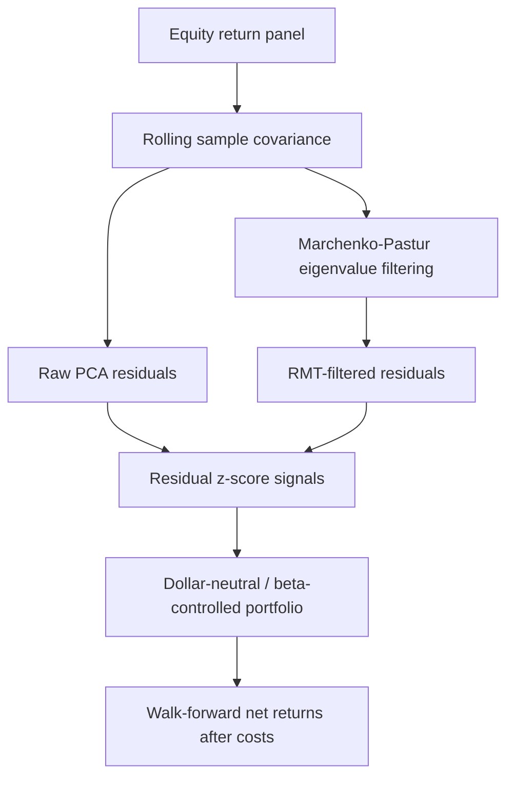

# Spectral Signal Extraction for Statistical Arbitrage

I built this repository around my Georgia Tech project on spectral denoising,
residual mean reversion, and cost-aware long/short portfolio construction.

The repo includes:

- a reproducible residual-extraction and portfolio-construction pipeline
- naive PCA and Marchenko-Pastur-filtered spectral comparisons
- log-return correlation filtering and validation-window eigenspectrum diagnostics
- dollar-neutral, beta-controlled long/short backtests
- transaction-cost, sensitivity, and regime diagnostics
- committed figures, CSV results, and a walkthrough notebook/report
- tests and CI for the runnable benchmark workflow

## What This Repo Contains

This repository is the runnable version of the project. The included benchmark
dataset is structured rather than historical, so the code, results, and
comparisons can be inspected without redistributing private research data. The
goal is to isolate the statistical question: whether Marchenko-Pastur
filtering produces cleaner residuals and more stable mean-reversion signals
than naive fixed-rank PCA under the same portfolio rules.

## Research Question

> Does Marchenko-Pastur filtering improve residual mean-reversion signals
> relative to naive fixed-rank PCA once the portfolio is forced to stay
> dollar-neutral, beta-controlled, and cost-aware?

This is a research backtest, not a production trading system. The repo
emphasizes:

- shifted weights to avoid accidental look-ahead
- explicit validation / holdout separation for the public benchmark
- one-way turnover costs
- beta checks versus SPY
- parameter and regime robustness diagnostics

## Repository Scope

The original project behind the CV line was completed at Georgia Tech from
**August 2024 to May 2025** and used a broader historical equity panel that is
not redistributed here.

The repo itself ships a **structured benchmark panel**:

| Contents | Purpose |
|---|---|
| `data/sample_prices.csv` | Reproducible benchmark panel |
| `src/` | Research code for residual extraction and backtesting |
| `results/` | Benchmark results plus original-project summaries |
| `figures/` | Committed review-ready plots |
| `reports/original_project_summary.md` | Preserved summary of the original Georgia Tech project |

## Repository Layout

```text
.
├── data/
├── figures/
├── notebooks/
├── reports/
├── results/
├── src/
├── tests/
├── CONTRIBUTING.md
├── Makefile
├── pyproject.toml
└── README.md
```

## Quickstart

```bash
python3 -m venv .venv
source .venv/bin/activate
python -m pip install --upgrade pip
pip install -e ".[dev]"
```

## Run The Pipeline

```bash
python -m src.sample_data
python -m src.run_backtest
python -m src.generate_research_artifacts
pytest
```

## Public Benchmark Design

The committed public benchmark uses this split:

| Split | Dates | Purpose |
|---|---:|---|
| Train | 2019-01-02 to 2021-12-31 | First-pass design |
| Validation | 2022-01-03 to 2022-12-30 | Select the final spectral sleeve |
| Holdout | 2023-01-02 to 2025-06-30 | Final out-of-sample evaluation |

The original Georgia Tech project was closer to a rolling walk-forward study.
The public repo uses a cleaner validation / holdout split because it is easier
to audit from GitHub.

## Real Large-Cap Extension

The repo now also includes a local real-data extension built from Nasdaq's
public historical endpoint:

- helper: [src/fetch_real_data.py](/Users/achintyarayapolavarapu/Documents/Playground/spectral-stat-arb-research/src/fetch_real_data.py:1)
- real panel: [data/real_us_largecap_panel.csv](/Users/achintyarayapolavarapu/Documents/Playground/spectral-stat-arb-research/data/real_us_largecap_panel.csv:1)
- summary note: [reports/real_largecap_run_summary.md](/Users/achintyarayapolavarapu/Documents/Playground/spectral-stat-arb-research/reports/real_largecap_run_summary.md:1)
- results folder: [results/real_us_largecap](/Users/achintyarayapolavarapu/Documents/Playground/spectral-stat-arb-research/results/real_us_largecap)

This real panel covers `24` large-cap U.S. names across `6` sectors from
`2019-05-22` to `2025-06-30`. It is run with the explicit
`real_largecap` strategy profile:

```bash
python -m src.generate_research_artifacts \
  --input data/real_us_largecap_panel.csv \
  --results-dir results/real_us_largecap \
  --figures-dir figures/real_us_largecap \
  --strategy-profile real_largecap
```

That real profile adds slower rebalancing and benchmark gating to the
conservative RMT sleeve rather than silently changing the default synthetic
benchmark workflow. Under this real-data profile, the validation-selected final
alias is `rmt_filtered_ma100_slow`, which reaches:

- validation Sharpe `0.42`
- holdout Sharpe `0.54`
- holdout max drawdown `-3.8%`
- holdout average turnover `0.022`

That extension is useful because it separates two questions cleanly:

- does RMT improve residual construction relative to naive PCA?
- does the resulting daily stat-arb sleeve look deployable on a real panel?

## Public Benchmark Data Construction

The public benchmark is intentionally transparent and stylized. It is generated
by [src/sample_data.py](src/sample_data.py) and documented in
[reports/public_benchmark_data_construction.md](reports/public_benchmark_data_construction.md).

Headline construction choices:

- `24` synthetic equities across `6` sectors with `4` names per sector
- `1,694` business dates from `2019-01-02` through `2025-06-30`
- one market factor, one style factor, and one sector factor per sector
- a separate sector-level mean-reversion state that creates residual structure
- asset-specific idiosyncratic residual processes plus a cross-sectional common
  shock
- a benchmark series generated from the market and style states

Why this benchmark exists:

- It creates a finite-sample covariance-estimation problem in which naive
  fixed-rank PCA can overfit unstable eigenmodes.
- It makes the residual-denoising question reproducible from a public repo.
- It does **not** claim to replicate live market microstructure or the original
  Georgia Tech equity panel.

## Why This Benchmark Is Still Useful

The synthetic benchmark is designed to isolate the covariance-denoising problem
rather than claim live trading performance.

In real equity stat-arb research, the key difficulty is that the empirical
covariance matrix is noisy when the number of assets is large relative to the
lookback window. Naive PCA can remove unstable sample eigenvectors or leave
noisy common components in the residuals. The benchmark creates a controlled
environment with latent market, style, and sector factors plus residual
mean-reversion structure, allowing us to test whether RMT filtering improves
residual construction under known finite-sample noise.

The relevant comparison is not whether the strategy is production-ready, but
whether the RMT-filtered pipeline behaves better than the raw PCA baseline
under identical data, costs, neutrality constraints, and walk-forward
validation.

## Background Intuition

One useful way to motivate the project is through the older
"eigenportfolio" viewpoint: if \(w\) is a portfolio weight vector and
\(\Sigma\) is a covariance matrix, then the quadratic form \(w^\top \Sigma w\)
measures the portfolio's variance. In that setting, eigenvectors of the
covariance matrix can be read as orthogonal risk directions, and their
eigenvalues tell us how much variance each direction explains.

That viewpoint is helpful here even though this repository is not a
buy-and-hold eigenportfolio project. In broad equity panels, the largest
eigenvalue is often market-like, and the next few eigenvectors often reflect
sector or style structure. The stat-arb question is then not "which
eigenportfolio should I hold?" but rather "which common modes should I remove
before treating the remainder as stock-specific residual signal?"

This repository takes that background idea and turns it into a residualization
workflow. Raw PCA answers the question with a fixed-rank shortcut. The
Marchenko-Pastur filter answers it with a noise-aware spectral threshold. The
trading sleeve is then a way to test whether the better residualization rule
actually matters once costs and exposure controls are imposed.

## Theoretical Null-Model Lens

A second useful interpretation comes from the user's current Banach-space lower
singular value work. After RMT filtering, the residual panel is supposed to be
closer to stock-specific movement with the broad common market / sector modes
removed. A natural follow-up question is then:

> If the residual return matrix were only high-dimensional noise, could a
> constrained portfolio still find a direction that looks special just because
> the matrix is large and noisy?

That is where the theory gives a helpful null model. If \(R\) is a return
matrix and \(w\) is a portfolio vector, then the realized return path is the
linear image \(Rw\). In that language:

- the admissible set \(K\) represents allowed portfolio shapes
  (gross exposure, sparsity, long/short structure, neutrality constraints)
- the output geometry \(L\) represents how the resulting path is judged
  (variance-like size, path norm, or another risk functional)
- the lower singular value \(s^+_{K \to L}(R)\) asks how small the output can
  be over all admissible portfolios with unit \(K\)-size

For a pure-noise Gaussian residual matrix, that quantity gives the typical
scale of best / worst constrained behavior that should arise from noise alone.
More specifically, it acts as a no-degeneracy guarantee: among all admissible
portfolios, none should be able to create an almost-zero residual path just
because the residual matrix has a fake near-kernel. That matters because a
classic stat-arb overfit is to find an apparently ultra-low-risk in-sample
portfolio only because the covariance geometry is ill-conditioned, which can
artificially inflate Sharpe through the risk denominator.

So the theorem does not prove that the trading sleeve works. Its role is
conceptual and structural. It says the residual space is well-conditioned under
the portfolio constraints, so the backtest is less likely to be benefiting from
spurious low-risk directions created by high-dimensional noise alone. Any alpha
claim still requires a separate argument or separate evidence that the residual
signal has genuine predictive content.

## Spectral Estimation Details

Inside each rolling window, the repo now follows a more classical
correlation-filtering setup:

- transform arithmetic returns with `log1p`
- standardize those log returns asset by asset
- estimate the rolling correlation matrix on the standardized panel
- compare the empirical eigenvalues to the Marchenko-Pastur bulk
- reconstruct the filtered correlation matrix after zeroing discarded modes

This does not change the backtest return convention, which remains a
close-to-close arithmetic-return backtest. It only sharpens the spectral
estimation step and makes the RMT filter directly inspectable through the
committed result files.

This choice also cleanly separates two conventions that often get mixed
together in finance writing: the background eigenportfolio story is usually
told with linear returns, while the spectral filtering step here uses
log-standardized inputs for the correlation estimate. The backtest itself still
evaluates realized arithmetic returns after costs.

## Included Methods

| Strategy | Description |
|---|---|
| `sector_baseline` | Sector-neutral residual mean reversion without spectral factor extraction |
| `raw_pca_residual` | Naive fixed-rank PCA residualization |
| `rmt_filtered_residual` | Marchenko-Pastur-filtered spectral residualization |
| `rmt_filtered_conservative` | Lower-turnover version of the RMT sleeve |

The selected public spectral sleeve is currently:

- `rmt_filtered_residual`

The committed result tables expose that selected sleeve twice:

- once under its method label, `rmt_filtered_residual`
- once as `final_research_portfolio`, which is the selected validation winner
  carried into the main summary tables

## Method Flow



## Headline Public Benchmark Results

| Strategy | Validation Sharpe | Holdout Sharpe | Holdout Max DD | Holdout Beta | Holdout Turnover | Cost |
|---|---:|---:|---:|---:|---:|---:|
| Raw PCA Residual | `-0.87` | `-0.21` | `-5.1%` | `0.011` | `1.52` | 5 bps |
| RMT-Filtered Residual | `1.04` | `1.73` | `-2.7%` | `-0.004` | `1.54` | 5 bps |
| Final Research Portfolio | `1.04` | `1.73` | `-2.7%` | `-0.004` | `1.54` | 5 bps |

In this public benchmark, naive fixed-rank PCA underperforms out of sample,
while the RMT-filtered sleeve remains positive after costs and shows better
drawdown and beta behavior under the same portfolio rules.

## Robustness Checks

The repo includes:

- [results/cost_sensitivity.csv](results/cost_sensitivity.csv)
- [results/eigenvalue_filter_diagnostics.csv](results/eigenvalue_filter_diagnostics.csv)
- [results/parameter_sensitivity.csv](results/parameter_sensitivity.csv)
- [results/regime_summary.csv](results/regime_summary.csv)
- [results/validation_window_correlation.csv](results/validation_window_correlation.csv)
- [results/validation_window_rmt_filtered_correlation.csv](results/validation_window_rmt_filtered_correlation.csv)
- [results/factor_diagnostics.csv](results/factor_diagnostics.csv)

Two notable findings from the committed results:

- the selected RMT sleeve stays positive under `rolling_window ±20%`, with
  holdout Sharpe between `1.63` and `1.76`
- cost sensitivity is severe: holdout Sharpe drops from `5.63` at `1` bp to
  `1.73` at `5` bps and turns negative at `10` bps

## Cost Sensitivity Interpretation

The public benchmark is intentionally turnover-sensitive because residual
mean-reversion strategies trade frequently. The cost-sensitivity table shows
that the RMT sleeve performs well at `1`-`5` bps but deteriorates under higher
cost assumptions. The public benchmark is intentionally interpreted as a
residual-denoising experiment rather than a production trading strategy; the
cost-sensitivity results show that turnover reduction and more realistic
execution modeling would be required before treating the signal as deployable.

In a real implementation, the next research step would be to reduce turnover
through slower signal decay, thresholded rebalancing, liquidity-aware position
sizing, and explicit market-impact modeling.

## What This Public Benchmark Does Not Prove

This public benchmark does not prove a live tradable stat-arb edge.

Important limitations:

- The public panel is synthetic/structured, not a point-in-time historical
  equity universe.
- The benchmark does not model borrow fees, short availability, capacity,
  market impact, or intraday execution.
- Transaction costs are simplified as a fixed one-way cost on turnover.
- The RMT sleeve is highly cost-sensitive; performance deteriorates under
  larger cost assumptions.
- The benchmark is designed to test residual-denoising methodology, not to
  estimate deployable alpha.
- The original historical-data project is summarized separately, but raw
  historical data and exact private-run files are not redistributed.

## Key Files

- [results/final_performance_summary.csv](results/final_performance_summary.csv)
- [results/model_selection_summary.csv](results/model_selection_summary.csv)
- [figures/pca_vs_rmt_workflow.png](figures/pca_vs_rmt_workflow.png)
- [figures/final_equity_curve.png](figures/final_equity_curve.png)
- [figures/final_drawdown.png](figures/final_drawdown.png)
- [figures/rolling_sharpe.png](figures/rolling_sharpe.png)
- [figures/eigenvalue_filtering.png](figures/eigenvalue_filtering.png)
- [figures/rmt_filtered_correlation_heatmap.png](figures/rmt_filtered_correlation_heatmap.png)
- [figures/signal_correlation_heatmap.png](figures/signal_correlation_heatmap.png)
- [figures/parameter_sensitivity_heatmap.png](figures/parameter_sensitivity_heatmap.png)
- [figures/regime_breakdown.png](figures/regime_breakdown.png)
- [figures/factor_count_timeline.png](figures/factor_count_timeline.png)

## Original Project Summary

The original Georgia Tech project is summarized in:

- [reports/original_project_summary.md](reports/original_project_summary.md)
- [reports/original_project_evidence/original_historical_run_summary.md](reports/original_project_evidence/original_historical_run_summary.md)
- [reports/original_project_evidence/original_results_table.md](reports/original_project_evidence/original_results_table.md)
- [results/original_project_performance_summary.csv](results/original_project_performance_summary.csv)
- [results/original_project_method_summary.csv](results/original_project_method_summary.csv)
- [results/original_project_cost_sensitivity.csv](results/original_project_cost_sensitivity.csv)
- [results/original_historical_performance_summary.csv](results/original_historical_performance_summary.csv)
- [reports/original_project_evidence/README.md](reports/original_project_evidence/README.md)
- [reports/original_project_evidence/preserved_cv_project_excerpt.md](reports/original_project_evidence/preserved_cv_project_excerpt.md)

The current evidence hierarchy is:

1. runnable benchmark code and committed results
2. preserved written summaries of the original Georgia Tech result
3. contemporaneous external claim snapshots

What is still missing is a raw original-project output table or screenshot.

## Limitations

- The public benchmark is structured and reproducible, not a redistributed live
  market dataset.
- Execution is simplified to close-to-close returns with one-way turnover
  costs.
- Capacity, borrow, and impact are not modeled.
- The repo should be read as a reproducible research record, not a direct
  production-trading claim.

## Next Research Steps

Natural extensions:

1. Replace the synthetic panel with a point-in-time liquid U.S. equity
   universe.
2. Add sector-neutral and liquidity-aware constraints.
3. Model borrow fees, spreads, and market impact.
4. Compare Marchenko-Pastur filtering with Ledoit-Wolf shrinkage, nonlinear
   shrinkage, and robust covariance estimators.
5. Study turnover reduction through thresholded rebalancing and signal decay.
6. Evaluate stability across different lookback windows, universe sizes, and
   market regimes.
