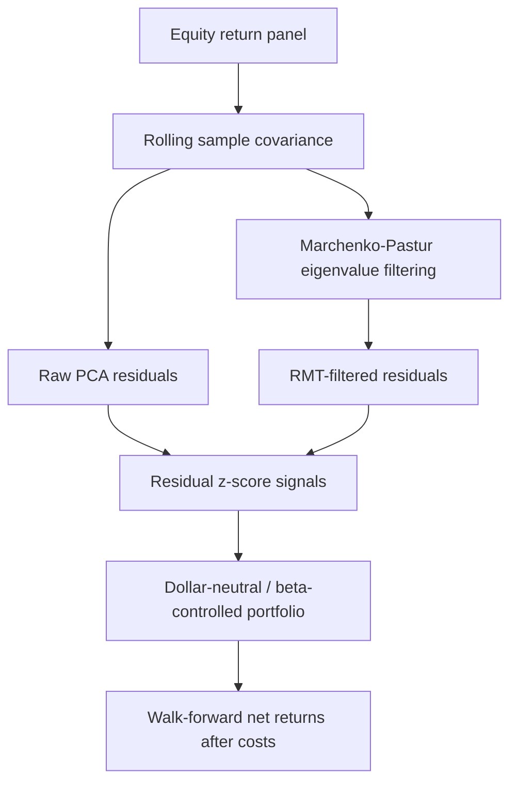

# Spectral Signal Extraction for Statistical Arbitrage

Cross-sectional equity stat-arb research repository built around a Georgia Tech
project on spectral denoising, residual mean reversion, and cost-aware
long/short portfolio construction.

The public repo includes:

- a reproducible residual-extraction and portfolio-construction pipeline
- naive PCA and Marchenko-Pastur-filtered spectral comparisons
- dollar-neutral, beta-controlled long/short backtests
- transaction-cost, sensitivity, and regime diagnostics
- committed figures, CSV artifacts, and a walkthrough notebook/report
- tests and CI for the runnable public benchmark workflow

## Reviewer Takeaway

This repository is a stylized, reproducible benchmark for testing PCA versus
RMT-filtered residual extraction in a cross-sectional stat-arb setting.

The public benchmark uses synthetic/structured equity data so that the
methodology can be inspected without redistributing private historical data. It
is not claimed to establish a live tradable edge or reproduce the original
historical backtest. The goal is to isolate the statistical question: whether
Marchenko-Pastur filtering can produce cleaner residuals and more stable
mean-reversion signals than naive fixed-rank PCA under controlled conditions.

## Research Question

> Does Marchenko-Pastur filtering improve residual mean-reversion signals
> relative to naive fixed-rank PCA once the portfolio is forced to stay
> dollar-neutral, beta-controlled, and cost-aware?

This is a research backtest, not a production trading system. The repo
emphasizes:

- shifted weights to avoid accidental look-ahead
- explicit validation / holdout separation for the public benchmark
- one-way turnover costs
- beta checks versus SPY
- parameter and regime robustness diagnostics

## Public Artifact vs. Original Georgia Tech Project

The original project behind the CV line was completed at Georgia Tech from
**August 2024 to May 2025** and used a broader historical equity panel that is
not redistributed here.

The public repo instead ships a **structured benchmark panel**:

| Artifact | Purpose |
|---|---|
| `data/sample_prices.csv` | Reproducible benchmark panel |
| `src/` | Research code for residual extraction and backtesting |
| `results/` | Public benchmark artifact pack plus original-project summaries |
| `figures/` | Committed review-ready plots |
| `reports/original_project_summary.md` | Preserved summary of the original Georgia Tech project |

## Repository Layout

```text
.
├── data/
├── figures/
├── notebooks/
├── reports/
├── results/
├── src/
├── tests/
├── CONTRIBUTING.md
├── Makefile
├── pyproject.toml
└── README.md
```

## Quickstart

```bash
python3 -m venv .venv
source .venv/bin/activate
python -m pip install --upgrade pip
pip install -e ".[dev]"
```

## Run The Pipeline

```bash
python -m src.sample_data
python -m src.run_backtest
python -m src.generate_research_artifacts
pytest
```

Console scripts are also available after editable install:

```bash
statarb-backtest
statarb-plots
statarb-artifacts
```

## Public Benchmark Design

The committed public benchmark uses this split:

| Split | Dates | Purpose |
|---|---:|---|
| Train | 2019-01-02 to 2021-12-31 | First-pass design |
| Validation | 2022-01-03 to 2022-12-30 | Select the final spectral sleeve |
| Holdout | 2023-01-02 to 2025-06-30 | Final out-of-sample evaluation |

The original Georgia Tech project was closer to a rolling walk-forward study.
The public repo uses a cleaner validation / holdout split because it is easier
to audit from GitHub.

## Public Benchmark Data Construction

The public benchmark is intentionally transparent and stylized. It is generated
by [src/sample_data.py](src/sample_data.py) and documented in
[reports/public_benchmark_data_construction.md](reports/public_benchmark_data_construction.md).

Headline construction choices:

- `24` synthetic equities across `6` sectors with `4` names per sector
- `1,694` business dates from `2019-01-02` through `2025-06-30`
- one market factor, one style factor, and one sector factor per sector
- a separate sector-level mean-reversion state that creates residual structure
- asset-specific idiosyncratic residual processes plus a cross-sectional common
  shock
- a benchmark series generated from the market and style states

Why this benchmark exists:

- It creates a finite-sample covariance-estimation problem in which naive
  fixed-rank PCA can overfit unstable eigenmodes.
- It makes the residual-denoising question reproducible from a public repo.
- It does **not** claim to replicate live market microstructure or the original
  Georgia Tech equity panel.

## Why This Benchmark Is Still Useful

The synthetic benchmark is designed to isolate the covariance-denoising problem
rather than claim live trading performance.

In real equity stat-arb research, the key difficulty is that the empirical
covariance matrix is noisy when the number of assets is large relative to the
lookback window. Naive PCA can remove unstable sample eigenvectors or leave
noisy common components in the residuals. The benchmark creates a controlled
environment with latent market, style, and sector factors plus residual
mean-reversion structure, allowing us to test whether RMT filtering improves
residual construction under known finite-sample noise.

The relevant comparison is not whether the strategy is production-ready, but
whether the RMT-filtered pipeline behaves better than the raw PCA baseline
under identical data, costs, neutrality constraints, and walk-forward
validation.

## Included Methods

| Strategy | Description |
|---|---|
| `sector_baseline` | Sector-neutral residual mean reversion without spectral factor extraction |
| `raw_pca_residual` | Naive fixed-rank PCA residualization |
| `rmt_filtered_residual` | Marchenko-Pastur-filtered spectral residualization |
| `rmt_filtered_conservative` | Lower-turnover version of the RMT sleeve |

The selected public spectral sleeve is currently:

- `rmt_filtered_residual`

The committed artifact pack exposes that selected sleeve twice:

- once under its method label, `rmt_filtered_residual`
- once as `final_research_portfolio`, which is the selected validation winner
  carried into the review-facing summary tables

## Method Flow



## Headline Public Benchmark Results

| Strategy | Validation Sharpe | Holdout Sharpe | Holdout Max DD | Holdout Beta | Holdout Turnover | Cost |
|---|---:|---:|---:|---:|---:|---:|
| Raw PCA Residual | `-1.04` | `-0.29` | `-5.5%` | `0.009` | `1.52` | 5 bps |
| RMT-Filtered Residual | `1.04` | `1.76` | `-2.8%` | `-0.003` | `1.54` | 5 bps |
| Final Research Portfolio | `1.04` | `1.76` | `-2.8%` | `-0.003` | `1.54` | 5 bps |

The public benchmark is useful for one clear conclusion: naive fixed-rank PCA
breaks down out of sample, while the RMT-filtered sleeve remains positive after
costs and materially improves drawdown and beta stability.

## Public Robustness Checks

The public artifact pack includes:

- [results/cost_sensitivity.csv](results/cost_sensitivity.csv)
- [results/parameter_sensitivity.csv](results/parameter_sensitivity.csv)
- [results/regime_summary.csv](results/regime_summary.csv)
- [results/factor_diagnostics.csv](results/factor_diagnostics.csv)

Two notable findings from the committed artifact pack:

- the selected RMT sleeve stays positive under `rolling_window ±20%`, with
  holdout Sharpe between `1.73` and `1.77`
- cost sensitivity is severe: holdout Sharpe drops from `5.65` at `1` bp to
  `1.76` at `5` bps and turns negative at `10` bps

## Cost Sensitivity Interpretation

The public benchmark is intentionally turnover-sensitive because residual
mean-reversion strategies trade frequently. The cost-sensitivity table shows
that the RMT sleeve performs well at `1`-`5` bps but deteriorates under higher
cost assumptions. This is a limitation, not a production claim.

In a real implementation, the next research step would be to reduce turnover
through slower signal decay, thresholded rebalancing, liquidity-aware position
sizing, and explicit market-impact modeling.

## What This Public Benchmark Does Not Prove

This public benchmark does not prove a live tradable stat-arb edge.

Important limitations:

- The public panel is synthetic/structured, not a point-in-time historical
  equity universe.
- The benchmark does not model borrow fees, short availability, capacity,
  market impact, or intraday execution.
- Transaction costs are simplified as a fixed one-way cost on turnover.
- The RMT sleeve is highly cost-sensitive; performance deteriorates under
  larger cost assumptions.
- The benchmark is designed to test residual-denoising methodology, not to
  estimate deployable alpha.
- The original historical-data project is summarized separately, but raw
  historical data and exact private-run artifacts are not redistributed.

## Key Artifacts

- [results/final_performance_summary.csv](results/final_performance_summary.csv)
- [results/model_selection_summary.csv](results/model_selection_summary.csv)
- [figures/final_equity_curve.png](figures/final_equity_curve.png)
- [figures/final_drawdown.png](figures/final_drawdown.png)
- [figures/rolling_sharpe.png](figures/rolling_sharpe.png)
- [figures/signal_correlation_heatmap.png](figures/signal_correlation_heatmap.png)
- [figures/parameter_sensitivity_heatmap.png](figures/parameter_sensitivity_heatmap.png)
- [figures/regime_breakdown.png](figures/regime_breakdown.png)
- [figures/factor_count_timeline.png](figures/factor_count_timeline.png)

## Original Project Summary

The original Georgia Tech project is summarized in:

- [reports/original_project_summary.md](reports/original_project_summary.md)
- [results/original_project_performance_summary.csv](results/original_project_performance_summary.csv)
- [results/original_project_method_summary.csv](results/original_project_method_summary.csv)
- [results/original_project_cost_sensitivity.csv](results/original_project_cost_sensitivity.csv)
- [reports/original_project_evidence/README.md](reports/original_project_evidence/README.md)
- [reports/original_project_evidence/preserved_cv_project_excerpt.md](reports/original_project_evidence/preserved_cv_project_excerpt.md)

## Limitations

- The public benchmark is structured and reproducible, not a redistributed live
  market dataset.
- Execution is simplified to close-to-close returns with one-way turnover
  costs.
- Capacity, borrow, and impact are not modeled.
- The public repo should be read as a reproducible research artifact, not a
  direct production-trading claim.

## Next Research Steps

Natural extensions:

1. Replace the synthetic panel with a point-in-time liquid U.S. equity
   universe.
2. Add sector-neutral and liquidity-aware constraints.
3. Model borrow fees, spreads, and market impact.
4. Compare Marchenko-Pastur filtering with Ledoit-Wolf shrinkage, nonlinear
   shrinkage, and robust covariance estimators.
5. Study turnover reduction through thresholded rebalancing and signal decay.
6. Evaluate stability across different lookback windows, universe sizes, and
   market regimes.
